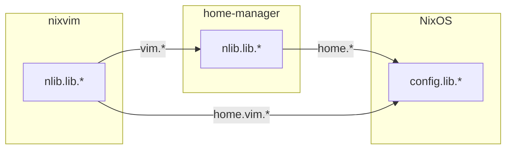

# nlib

A Nix library framework implementing the **Lib Modules Pattern** - where library functions are defined as module options with built-in types, tests, and documentation.

## The Problem

Writing Nix libraries typically means:
- Functions scattered across files with no consistent structure
- Tests living separately (or not existing at all)
- Types and documentation as afterthoughts
- No standard way to compose libraries

## The Solution: Lib Modules Pattern

Define functions as **config values** that bundle everything together:

```nix
nlib.lib.double = {
  type = lib.types.functionTo lib.types.int;
  fn = x: x * 2;
  description = "Double a number";
  tests."doubles 5" = { args.x = 5; expected = 10; };
};
```

This gives you:
- **Type safety** - explicit Nix types for your functions
- **Built-in testing** - tests live with the code
- **Documentation** - descriptions in one place
- **Composition** - use the NixOS module system to combine libraries
- **Nested propagation** - libs from nested modules (home-manager in NixOS) are accessible in parent scope

## Quick Start

See `examples/` for complete working examples of each module system.

## API Reference

### Defining Libraries

Define libs at `nlib.lib.<name>` (supports nested namespaces like `nlib.lib.utils.helper`):

```nix
nlib.lib.myFunc = {
  type = lib.types.functionTo lib.types.int;  # Required: function signature
  fn = x: x * 2;                               # Required: implementation
  description = "What it does";                # Required: documentation
  tests."test name" = {                        # Optional: test cases
    args.x = 5;
    expected = 10;
  };
  visible = true;                              # Optional: public (true) or private (false)
};
```

### Lib Flow


### Lib Output Layers

Libs defined in different module systems are available at different paths:

#### Flake-Level Libs (pure, no pkgs)

| Defined in | Module to import | Access within module | Flake output |
|------------|------------------|---------------------|--------------|
| flake-parts `nlib.lib.*` | `flakeModules.default` | `config.lib.flake.<name>` | `flake.lib.flake.<name>` |
| perSystem `nlib.lib.*` | `flakeModules.default` | `config.lib.<name>` | `legacyPackages.<system>.nlib.<name>` |

#### System Configuration Libs

| Defined in | Module to import | Access within module | Flake output |
|------------|------------------|---------------------|--------------|
| NixOS `nlib.lib.*` | `nixosModules.default` | `config.lib.<name>` | `flake.lib.nixos.<name>` |
| home-manager `nlib.lib.*` | `homeModules.default` | `config.lib.<name>` | `flake.lib.home.<name>` |
| nix-darwin `nlib.lib.*` | `darwinModules.default` | `config.lib.<name>` | `flake.lib.darwin.<name>` |
| nixvim `nlib.lib.*` | `nixvimModules.default` | `config.lib.<name>` | `flake.lib.vim.<name>` |
| system-manager `nlib.lib.*` | `systemManagerModules.default` | `config.lib.<name>` | `flake.lib.system.<name>` |

### Nested Module Propagation

When a parent module imports a nested module system, the nested libs are automatically accessible in the parent scope under a namespace prefix.



#### Nested Libs Access Table

| Parent module | Nested module | Libs defined in nested | Access in parent |
|---------------|---------------|------------------------|------------------|
| NixOS | home-manager | `nlib.lib.foo` | `config.lib.home.foo` |
| NixOS | home-manager → nixvim | `nlib.lib.bar` | `config.lib.home.vim.bar` |
| nix-darwin | home-manager | `nlib.lib.foo` | `config.lib.home.foo` |
| nix-darwin | home-manager → nixvim | `nlib.lib.bar` | `config.lib.home.vim.bar` |
| home-manager | nixvim | `nlib.lib.bar` | `config.lib.vim.bar` |

#### Namespace Prefixes

| Module system | Namespace prefix |
|---------------|------------------|
| home-manager | `home` |
| nixvim | `vim` |
| nix-darwin | `darwin` |
| system-manager | `system` |

### Flake Outputs Summary

All libs are collected and exported at the flake level under `flake.lib.<namespace>`:

| Namespace | Source | Description |
|-----------|--------|-------------|
| `flake.lib.flake.*` | `nlib.lib.*` in flake-parts | Pure flake-level libs |
| `flake.lib.nixos.*` | `nixosConfigurations.*.nlib.lib.*` | NixOS configuration libs |
| `flake.lib.home.*` | `homeConfigurations.*.nlib.lib.*` | Standalone home-manager libs |
| `flake.lib.darwin.*` | `darwinConfigurations.*.nlib.lib.*` | nix-darwin libs |
| `flake.lib.vim.*` | `nixvimConfigurations.*.nlib.lib.*` | Standalone nixvim libs |
| `flake.lib.system.*` | `systemConfigs.*.nlib.lib.*` | system-manager libs |

## Available Modules

Import the adapter for your module system. Libs are automatically available at `config.lib.*`:

| Module | Import path |
|--------|-------------|
| `flakeModules.default` | `inputs.nlib.flakeModules.default` |
| `nixosModules.default` | `nlib.nixosModules.default` |
| `homeModules.default` | `nlib.homeModules.default` |
| `darwinModules.default` | `nlib.darwinModules.default` |
| `nixvimModules.default` | `nlib.nixvimModules.default` |
| `systemManagerModules.default` | `nlib.systemManagerModules.default` |

## Test Formats

### Simple expected value

```nix
tests."test name" = {
  args.x = 5;       # Argument passed to fn
  expected = 10;    # Expected return value
};
```

### Multiple arguments

```nix
tests."test name" = {
  args.x = { a = 2; b = 3; };  # For fn = { a, b }: a + b
  expected = 5;
};
```

### Multiple assertions

```nix
tests."test name" = {
  args.x = 5;
  assertions = [
    { name = "is positive"; check = result: result > 0; }
    { name = "is even"; check = result: lib.mod result 2 == 0; }
    { name = "equals 10"; expected = 10; }
  ];
};
```

## See Also

- `examples/` - Working examples for each module system
- `CONTRIBUTING.md` - Development and testing guide
