# nix-lib

A Nix library framework implementing the **Lib Modules Pattern** - where library functions are defined as module options with built-in types, tests, and documentation.

## The Problem

Writing Nix libraries typically means:
- Functions scattered across files with no consistent structure
- Tests living separately (or not existing at all)
- Types and documentation as afterthoughts
- No standard way to compose libraries

## The Solution: Lib Modules Pattern

Define functions as **config values** that bundle everything together:

```nix
nix-lib.lib.double = {
  type = lib.types.functionTo lib.types.int;
  fn = x: x * 2;
  description = "Double a number";
  tests."doubles 5" = { args.x = 5; expected = 10; };
};
```

This gives you:
- **Type safety** - explicit Nix types for your functions
- **Built-in testing** - tests live with the code (nix-unit integration)
- **Documentation** - descriptions in one place
- **Composition** - use the NixOS module system to combine libraries
- **Nested propagation** - libs from nested modules (home-manager in NixOS) are accessible in parent scope

## Quick Start

```nix
{
  inputs.nix-lib.url = "github:Dauliac/nix-lib";

  outputs = { nix-lib, ... }:
    nix-lib.inputs.flake-parts.lib.mkFlake { inherit inputs; } {
      imports = [ nix-lib.flakeModules.default ];

      # Define a pure flake-level lib
      nix-lib.lib.double = {
        type = lib.types.functionTo lib.types.int;
        fn = x: x * 2;
        description = "Double a number";
        tests."doubles 5" = { args.x = 5; expected = 10; };
      };
    };
}
```

See `examples/` for complete working examples of each module system.

## API Reference

### Defining Libraries

Define libs at `nix-lib.lib.<name>` (supports nested namespaces like `nix-lib.lib.utils.helper`):

```nix
nix-lib.lib.myFunc = {
  type = lib.types.functionTo lib.types.int;  # Required: function signature
  fn = x: x * 2;                               # Required: implementation
  description = "What it does";                # Required: documentation
  tests."test name" = {                        # Optional: test cases
    args.x = 5;
    expected = 10;
  };
  visible = true;                              # Optional: public (true) or private (false)
};
```

### Lib Flow

```mermaid
flowchart TB
    subgraph Input["Define (nix-lib.lib.*)"]
        D1["nix-lib.lib.myFunc = {<br/>type, fn, description, tests}"]
    end

    subgraph Process["nix-lib Processing"]
        P1["Extract fn → config.lib.*"]
        P2["Extract tests → flake.tests"]
        P3["Store metadata → nix-lib._libsMeta"]
    end

    subgraph Output["Outputs"]
        O1["config.lib.myFunc<br/>(use in module)"]
        O2["flake.lib.namespace.myFunc<br/>(flake export)"]
        O3["flake.tests.test_myFunc_*<br/>(nix-unit tests)"]
    end

    D1 --> P1
    D1 --> P2
    D1 --> P3
    P1 --> O1
    P1 --> O2
    P2 --> O3
```




### Lib Output Layers

Libs defined in different module systems are available at different paths:

#### Flake-Level Libs (pure, no pkgs)

| Defined in | Module to import | Access within module | Flake output |
|------------|------------------|---------------------|--------------|
| flake-parts `nix-lib.lib.*` | `flakeModules.default` | `config.lib.flake.<name>` | `flake.lib.flake.<name>` |
| perSystem `nix-lib.lib.*` | `flakeModules.default` | `config.lib.<name>` | `legacyPackages.<system>.nix-lib.<name>` |

#### System Configuration Libs

| Defined in | Module to import | Access within module | Flake output |
|------------|------------------|---------------------|--------------|
| NixOS `nix-lib.lib.*` | `nixosModules.default` | `config.lib.<name>` | `flake.lib.nixos.<name>` |
| home-manager `nix-lib.lib.*` | `homeModules.default` | `config.lib.<name>` | `flake.lib.home.<name>` |
| nix-darwin `nix-lib.lib.*` | `darwinModules.default` | `config.lib.<name>` | `flake.lib.darwin.<name>` |
| nixvim `nix-lib.lib.*` | `nixvimModules.default` | `config.lib.<name>` | `flake.lib.vim.<name>` |
| system-manager `nix-lib.lib.*` | `systemManagerModules.default` | `config.lib.<name>` | `flake.lib.system.<name>` |

### Nested Module Propagation

When a parent module imports a nested module system, the nested libs are automatically accessible in the parent scope under a namespace prefix.


#### Nested Libs Access Table

| Parent module | Nested module | Libs defined in nested | Access in parent |
|---------------|---------------|------------------------|------------------|
| NixOS | home-manager | `nix-lib.lib.foo` | `config.lib.home.foo` |
| NixOS | home-manager → nixvim | `nix-lib.lib.bar` | `config.lib.home.vim.bar` |
| nix-darwin | home-manager | `nix-lib.lib.foo` | `config.lib.home.foo` |
| nix-darwin | home-manager → nixvim | `nix-lib.lib.bar` | `config.lib.home.vim.bar` |
| home-manager | nixvim | `nix-lib.lib.bar` | `config.lib.vim.bar` |

#### Namespace Prefixes

| Module system | Namespace prefix |
|---------------|------------------|
| home-manager | `home` |
| nixvim | `vim` |
| nix-darwin | `darwin` |
| system-manager | `system` |

### Flake Outputs Summary

All libs are collected and exported at the flake level under `flake.lib.<namespace>`:

| Namespace | Source | Description |
|-----------|--------|-------------|
| `flake.lib.flake.*` | `nix-lib.lib.*` in flake-parts | Pure flake-level libs |
| `flake.lib.nix-lib.*` | nix-lib internals | `mkAdapter`, `backends` utilities |
| `flake.lib.nixos.*` | `nixosConfigurations.*.config.lib.*` | NixOS configuration libs |
| `flake.lib.home.*` | `homeConfigurations.*.config.lib.*` | Standalone home-manager libs |
| `flake.lib.darwin.*` | `darwinConfigurations.*.config.lib.*` | nix-darwin libs |
| `flake.lib.vim.*` | `nixvimConfigurations.*.config.lib.*` | Standalone nixvim libs |
| `flake.lib.system.*` | `systemConfigs.*.config.lib.*` | system-manager libs |
| `flake.lib.wrappers.*` | `wrapperConfigurations.*.config.lib.*` | nix-wrapper-modules libs |

Per-system libs are available at `legacyPackages.<system>.lib.<namespace>.*`.

## Available Modules

Import the adapter for your module system. Libs are automatically available at `config.lib.*`:

| Module | Import path |
|--------|-------------|
| `flakeModules.default` | `inputs.nix-lib.flakeModules.default` |
| `nixosModules.default` | `nix-lib.nixosModules.default` |
| `homeModules.default` | `nix-lib.homeModules.default` |
| `darwinModules.default` | `nix-lib.darwinModules.default` |
| `nixvimModules.default` | `nix-lib.nixvimModules.default` |
| `systemManagerModules.default` | `nix-lib.systemManagerModules.default` |
| `wrapperModules.default` | `nix-lib.wrapperModules.default` |

## Test Formats

### Simple expected value

```nix
tests."test name" = {
  args.x = 5;       # Argument passed to fn
  expected = 10;    # Expected return value
};
```

### Multiple arguments

```nix
tests."test name" = {
  args.x = { a = 2; b = 3; };  # For fn = { a, b }: a + b
  expected = 5;
};
```

### Multiple assertions

```nix
tests."test name" = {
  args.x = 5;
  assertions = [
    { name = "is positive"; check = result: result > 0; }
    { name = "is even"; check = result: lib.mod result 2 == 0; }
    { name = "equals 10"; expected = 10; }
  ];
};
```

## Wrapper Module Systems

nix-lib supports wrapper-based module systems that create wrapped executables:

- **[nix-wrapper-modules](https://github.com/BirdeeHub/nix-wrapper-modules)** - Module system for wrapped packages with DAG-based flag ordering
- **[Lassulus/wrappers](https://github.com/Lassulus/wrappers)** - Library for creating wrapped executables via module evaluation

Both use `lib.evalModules` internally, making them compatible with nix-lib's adapter system.

### Basic Usage

```nix
{
  inputs = {
    nix-lib.url = "github:Dauliac/nix-lib";
    nix-wrapper-modules.url = "github:BirdeeHub/nix-wrapper-modules";
    # Or: wrappers.url = "github:Lassulus/wrappers";
  };

  outputs = { nixpkgs, nix-lib, nix-wrapper-modules, ... }:
    nix-lib.inputs.flake-parts.lib.mkFlake { inherit inputs; } {
      imports = [ nix-lib.flakeModules.default ];

      # Define wrapper configurations
      flake.wrapperConfigurations.myApp = nixpkgs.lib.evalModules {
        modules = [
          # nix-lib adapter for wrappers
          nix-lib.wrapperModules.default

          # Your wrapper libs
          {
            nix-lib.enable = true;
            nix-lib.lib.mkFlags = {
              type = lib.types.functionTo lib.types.attrs;
              fn = name: flags: { drv.flags.${name} = flags; };
              description = "Generate wrapper flags";
            };
          }
        ];
      };
    };
}
```

### With nix-wrapper-modules

```nix
# Use BirdeeHub's wrapper definitions
flake.wrapperConfigurations.alacritty =
  inputs.nix-wrapper-modules.wrappers.alacritty.wrap {
    inherit pkgs;
    modules = [
      nix-lib.wrapperModules.default
      {
        nix-lib.enable = true;
        nix-lib.lib.terminalHelper = {
          type = lib.types.functionTo lib.types.attrs;
          fn = shell: { settings.terminal.shell.program = shell; };
          description = "Set terminal shell";
        };
      }
    ];
    # Use the helper
    settings = config.lib.terminalHelper "${pkgs.zsh}/bin/zsh";
  };
```

### With Lassulus/wrappers

```nix
# Use Lassulus's wrapper modules
flake.wrapperConfigurations.mpv =
  inputs.wrappers.wrapperModules.mpv.apply {
    inherit pkgs;
    modules = [
      nix-lib.wrapperModules.default
      {
        nix-lib.enable = true;
        nix-lib.lib.addScript = {
          type = lib.types.functionTo lib.types.attrs;
          fn = script: { scripts = [ script ]; };
          description = "Add mpv script";
        };
      }
    ];
  };
```

### Accessing Wrapper Libs

Libs defined in wrapper configurations are collected at:

| Location | Path |
|----------|------|
| Within wrapper module | `config.lib.<name>` |
| Flake output | `flake.lib.wrappers.<name>` |

## Custom Module Systems

`mkAdapter` is generic and works with any NixOS-style module system:

```nix
# Create adapter for your custom module system
flake.myModules.default = inputs.nix-lib.outputs.lib.nix-lib.mkAdapter {
  name = "my-module-system";
  namespace = "my";
};

# Use in your module system
{ lib, config, ... }: {
  imports = [ myModules.default ];

  nix-lib.enable = true;
  nix-lib.lib.myHelper = {
    type = lib.types.functionTo lib.types.attrs;
    fn = x: { result = x; };
    description = "Custom helper";
  };

  # Available at: config.lib.myHelper
}
```

### Requirements

- Module system must support NixOS-style modules (`config`, `lib`, `options` args)
- No domain-specific options required - mkAdapter only sets `nix-lib.*` and `lib.*`

## Custom Collectors

Collectors aggregate libs from flake outputs into `flake.lib.<namespace>`. Define custom collectors via `nix-lib.collectorDefs`:

```nix
# In your flake-parts module
nix-lib.collectorDefs.wrappers = {
  pathType = "flat";                      # "flat" or "perSystem"
  configPath = [ "wrapperConfigurations" ]; # Path in flake outputs
  namespace = "wrappers";                 # Output at flake.lib.wrappers.*
  description = "nix-wrapper-modules libs";
};
```

### Path Types

| Type | Description | Collection Path |
|------|-------------|-----------------|
| `flat` | Direct configuration set | `flake.<configPath>.<name>.config.nix-lib._fns` |
| `perSystem` | Per-system in legacyPackages | `flake.legacyPackages.<system>.<configPath>` |

### Disabling Built-in Collectors

```nix
nix-lib.collectorDefs.nixos.enable = false;  # Disable NixOS collection
```

### Overriding Namespaces

```nix
nix-lib.collectorDefs.nixos.namespace = "os";  # flake.lib.os.* instead of flake.lib.nixos.*
```

## Testing

nix-lib uses [nix-unit](https://github.com/nix-community/nix-unit) for testing. Tests defined in `nix-lib.lib.*.tests` are automatically converted to nix-unit format.

### Running Tests

```bash
cd tests
nix run .#test
```

Output:
```
=== Running nix-unit tests ===
🎉 97/97 successful
=== All tests passed! ===
```

### Test Architecture

```mermaid
flowchart TB
    subgraph Define["Define Libraries"]
        L1["nix-lib.lib.double = {<br/>fn, type, tests...}"]
        L2["nix-lib.lib.add = {<br/>fn, type, tests...}"]
    end

    subgraph BDD["BDD Tests (tests/bdd/)"]
        B1["collectors.nix"]
        B2["adapters.nix"]
        B3["libDef.nix"]
    end

    subgraph PerSystem["perSystem.nix-unit.tests"]
        PS["System-specific tests"]
    end

    subgraph Generate["Auto-Generated"]
        G1["test_double_doubles_5"]
        G2["test_add_adds_positives"]
    end

    subgraph Merge["flake.tests"]
        M["All tests merged"]
    end

    subgraph Run["nix run .#test"]
        R["nix-unit --flake .#tests<br/>🎉 97/97 successful"]
    end

    L1 --> G1
    L2 --> G2
    G1 --> M
    G2 --> M
    B1 --> M
    B2 --> M
    B3 --> M
    PS --> M
    M --> R
```



Tests are organized in three layers:

| Layer | Location | Purpose |
|-------|----------|---------|
| **Unit tests** | `nix-lib.lib.*.tests` | Function behavior (defined with libs) |
| **BDD tests** | `tests/bdd/*.nix` | Structure validation (namespaces, adapters) |
| **perSystem tests** | `perSystem.nix-unit.tests` | System-specific lib checks |

All tests are merged into `flake.tests` and run together via `nix-unit --flake .#tests`.

### Writing Tests

Tests are defined alongside lib definitions:

```nix
nix-lib.lib.add = {
  type = lib.types.functionTo lib.types.int;
  fn = { a, b }: a + b;
  description = "Add two numbers";
  tests = {
    "adds positives" = { args.x = { a = 2; b = 3; }; expected = 5; };
    "adds negatives" = { args.x = { a = -1; b = -2; }; expected = -3; };
  };
};
```

For BDD-style structure tests, create modules in `tests/bdd/`:

```nix
# tests/bdd/myTests.nix
{ lib, config, ... }:
{
  # System-agnostic tests
  flake.tests = {
    "test_myFeature_works" = {
      expr = lib.hasAttr "myAttr" config.flake.lib;
      expected = true;
    };
  };

  # System-specific tests
  perSystem = { config, ... }: {
    nix-unit.tests = {
      "test_perSystem_lib_exists" = {
        expr = config.legacyPackages.lib != { };
        expected = true;
      };
    };
  };
}
```

**Note:** nix-unit requires test names to start with `test`.

## See Also

- `examples/` - Working examples for each module system
- `tests/` - Test flake with BDD tests
- `CONTRIBUTING.md` - Development and testing guide
